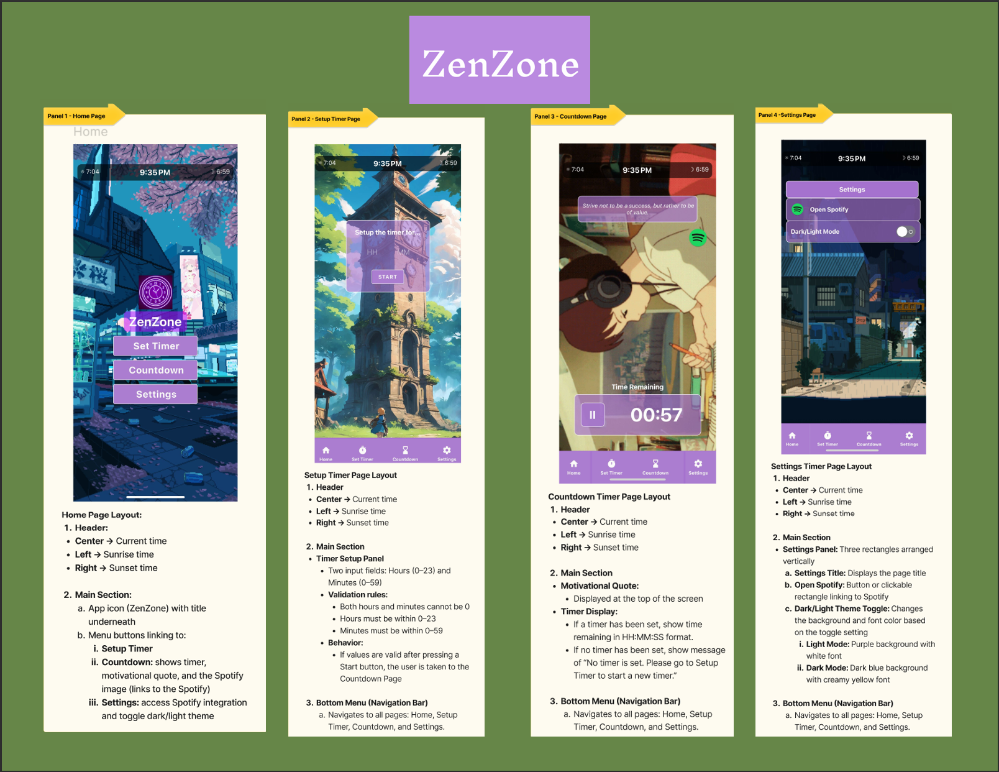

# Productivity-Timer_shared (ZenZone)

## Overview

ZenZone is a productivity and focus timer app built with React Native. It helps users set custom countdown timers, stay motivated with inspirational quotes, and see real-time sunrise and sunset information. The app also supports dark/light themes and integrates with Spotify for background music.

## Technologies Used
- **Languages and Frameworks:** JavaScript, React Native, Expo Snack
- **UI and Styling:** React Native Paper, Custom Dark/Light Themes (Context API)  
- **Navigation:** React Navigation (Stack Navigator, Bottom Menu)  
- **APIs and Data:** ipapi (location), sunrisesunset.io (sunrise/sunset), Fetch API  
- **Design and Prototyping:** Figma
- **Other Features:** Wallpaper caching and prefetching, validation and input handling, alerts/notifications  

---

## Demo

**Note:** The demo is sped up for faster demonstration. The timer shown is set to 1 minute in real use.

## Screenshots (Figma Dashboard)

Below is the Figma dashboard, showing each page and its functionality:

---

## Key Features

**1. Dynamic Wallpapers**

**2. Display of the Current Time, Sunrise and Sunset Times Based on Location via APIs**

**3. Custom Timer** 
  * Custom timer setup with validation (hours: 0-23, minutes: 0-59).
  * Countdown screen with formatted HH:MM:SS display.
  * Play/pause functionality.
  * Alert notification when timer ends.

**4. Display of a Motivational Quote During Countdown**

**5. Spotify Integration**

**6. Dark/Light Mode**
  * Dark/Light mode toggle available in Settings.
  * Colors adapt across all components.

**7. Intuitive Navigation**
  * Bottom navigation menu (Home, Set Timer, Countdown, Settings).
  * Smooth transitions between pages using React Navigation.

---

## File Structure

* **App.js** - Entry point; sets up navigation, global theme toggle, and wallpaper caching.
* **components/**

  * **Main.js** - Home screen with app logo and navigation buttons.
  * **SetUpTimer.js** - Timer setup page, allows users to set their timers.
  * **Countdown.js** - Countdown page showing remaining time, motivational quote, and Spotify link.
  * **Settings.js** - Settings page with dark/light theme toggle and Spotify shortcut.
* **components/functions/**

  * **BackgroundSetUp.js** - Shared wrapper that provides wallpapers, sunrise/sunset info, and current time across pages.
  * **BottomMenu.js** - Bottom navigation menu used in every page.
  * **TimerSetup.js** - Input rectangle for setting timer values.
  * **CurrentTime.js** - Utility for getting the current time in 12-hour format.
  * **SunTimes.js** - Context provider that fetches sunrise/sunset times based on location.
  * **DarkLight.js** - Theme definitions for dark and light modes.
  * **MotivationalQuotes.js** - Stores and returns random motivational quotes.
  * **renderWallpaper.js** - Manages wallpapers for all pages and prefetches them for performance.